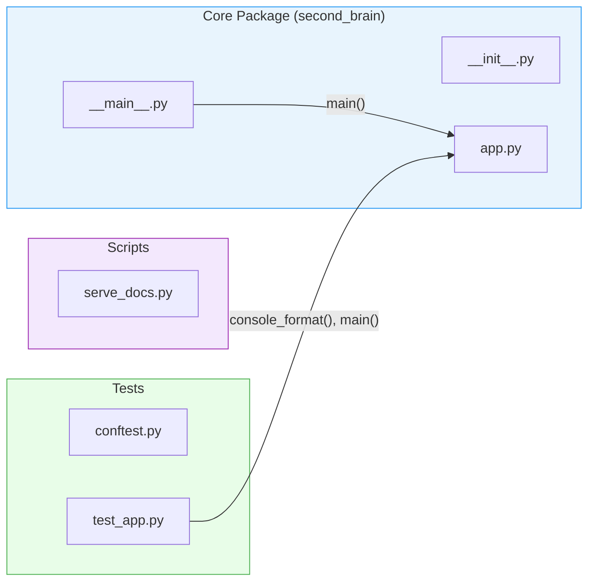

# Module Dependency Graph

No circular dependencies detected — all imports flow in one direction toward `app`.

## Safe-to-change analysis

| Module | Dependents | Risk |
|---|---|---|
| `app.py` | `__main__.py`, `test_app.py` | Highest — central module, changes cascade to entry point and tests |
| `__main__.py` | none | Safe — leaf node, only consumes `app.main()` |
| `serve_docs.py` | none | Safe — standalone script, no internal imports |
| `conftest.py` | none | Safe — only provides pytest fixtures |
| `test_app.py` | none | Safe — leaf node, only consumes from `app` |
| `__init__.py` | none | Safe — empty package marker |
